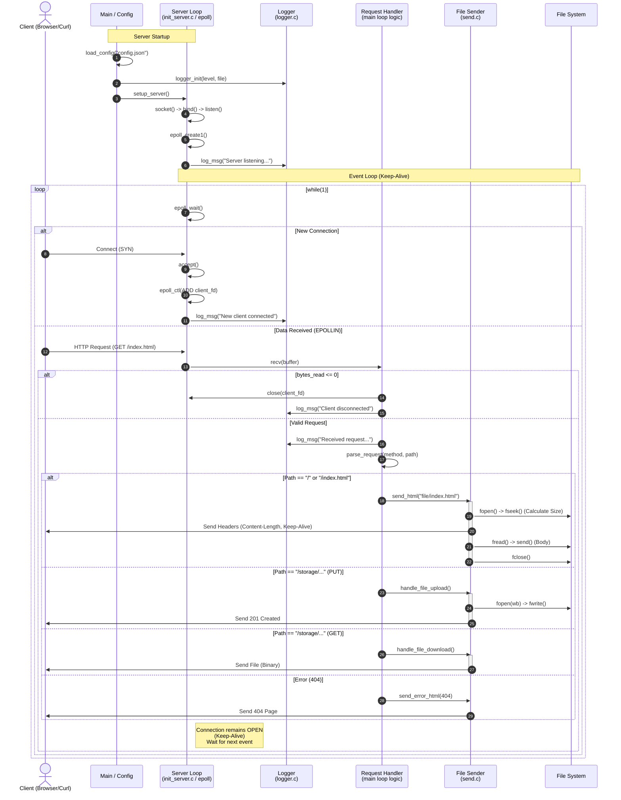

# Web Server in C

This is a lightweight HTTP web server implemented in C using the **epoll** Linux kernel system call for scalable I/O event notification. It is designed to handle multiple client connections efficiently using non-blocking I/O and supports features like file uploading, downloading, and configurable logging.

## Features

* **Non-blocking I/O:** Uses `epoll` edge-triggered mode for high concurrency.
* **Keep-Alive Support:** Maintains persistent connections for multiple requests per client.
* **Static File Serving:** Serves HTML, CSS, images, and other static assets.
* **File Management:**
	* **Upload:** Supports `PUT` requests to upload files to the server.
	* **Download:** Supports `GET` requests to download files.
* **Configurable:** Server settings (port, IP, limits) are loaded from a `config.json` file.
* **Logging System:** Robust logging with support for multiple levels (`INFO`, `DEBUG`, `WARN`, `ERROR`, `FATAL`) and file output.
* **Proxy/Integration Capabilities:** Includes `libcurl` integration for making external HTTP requests.
* **Load Testing Tool:** Includes a custom benchmark tool (`test_app`) to simulate high traffic and test server stability.

## Project Structure

* `src/`: Source code files.
	* `main.c`: Application entry point.
	* `init_server.c`: Core server logic, socket initialization, and the main epoll event loop.
	* `send.c`: Functions for constructing HTTP responses and handling file I/O (upload/download).
	* `http_methods.c`: Implementation of HTTP methods and external requests via `libcurl`.
	* `config_loader.c`: JSON configuration parser using `cJSON`.
	* `logger.c`: Logging system implementation.
* `include/`: Header files defining structures and function prototypes.
* `file/`: Directory for static web resources (HTML, CSS).
* `storage/`: Directory where uploaded files are saved.
* `test/`: Contains the `test.c` source code for the load testing application.
* `config.json`: Configuration file for the server.
* `Makefile`: Build script for compiling the server and the test application.

## Sequence Diagram



## Prerequisites

To build and run this project, you need a Linux environment with the following installed:

* **GCC** (GNU Compiler Collection) (ver. 13.3.0)
* **Make** (ver. 4.3)
* **libcurl** (for external HTTP requests ) (ver. 8.5.0)
* **cJSON** (for parsing configuration) (ver. 1.7.17-1)

**Install dependencies on Ubuntu/Debian:**
```bash
sudo apt-get update
sudo apt-get install build-essential libcurl4-openssl-dev libcjson-dev
```

## Build Instructions

Use the provided `Makefile` to compile both the server and the test application.

1.  **Build everything:**
	```bash
	make
	```
	This will generate two executables: `server` and `test_app`.

2.  **Clean build artifacts:**
	```bash
	make clean
	```

## Configuration

The server behavior is controlled by `config.json`. You can modify this file to change settings without recompiling.

**Example `config.json`:**
```json
{
	"ip": "127.0.0.1",
	"port": 8080,
	"max_connections": 1000,
	"root_directory": "storage",
	"debug_mode": true,
	"log_file": "server.log"
}
```

* ip: The IP address to bind to (e.g., "127.0.0.1" or "0.0.0.0").
* port: The port number to listen on.
* max_connections: Maximum number of concurrent connections (size of the epoll event list).
* root_directory: Directory containing static files (index.html, etc.).
* debug_mode: Set to true to enable verbose DEBUG logs in the console.
* log_file: Path to the file where logs should be written.

## How to Run

1. **Start the server:** Ensure config.json is in the same directory as the executable.
```bash
./server
```
You should see output indicating the server is listening on the configured port.

2. **Verify Operation:** Open your web browser and go to http://localhost:8080 (or your configured port). You should see the index.html page served from the file/ directory.

## Testing & Benchmarking

The project includes a multi-threaded load testing tool (test_app) designed to simulate high traffic and check for race conditions or connection handling errors.

**How the Test Works**

The test_app creates multiple threads (clients). Each thread:

1. Connects to the server.

2. Sends a sequence of HTTP requests using Keep-Alive.

3. Measures successful responses and failures.

4. Uses a "ramp-up" delay to simulate realistic traffic.

**Running the Test**

1. Start the server in one terminal:
```bash
./server
```

2. Run the benchmark in another terminal:
```bash
./test_app
```
**Sample Output**
```bash
==========================================
Starting Benchmark (Load Test)
Target: 127.0.0.1:8080
Threads (Clients): 500
Requests per Client: 10
Total expected requests: 5000
==========================================

--- TEST REPORT ---
RESULT: SUCCESS
Time taken:        1.20 seconds
Total requests:    5000
Successful hits:   5000
Failed hits:       0
Total bytes read:  0 MB
---------------------------
Requests Per Sec:  4152.74 req/sec
==========================================
```

## API & Endpoints

* **GET /index.html:** Serves the main page.
* **GET /storage/<filename>:** Downloads a file from the storage directory.

Example with curl:
```bash
curl -v -o /dev/null http://localhost:8080/storage/big_test.bin
```

* **PUT /storage/<filename>:** Uploads a file to the server.

Example with curl:
```bash
curl -X PUT --data-binary @Linux_Basics.txt http://localhost:8080/storage/linux.txt http://localhost:8080/storage/linux.txt
```